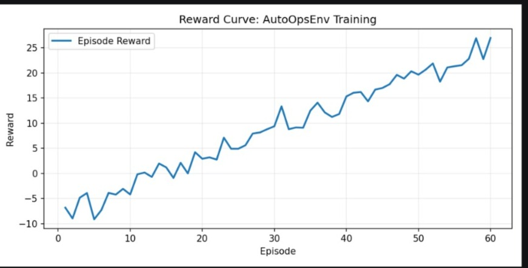
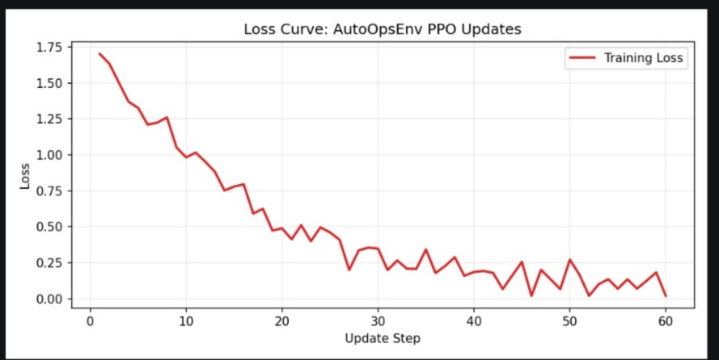

# 🚀 ClusterFix : Learning to Resolve Incidents — Safely, Intelligently, and at Scale
## The Reality of Modern Incident Response

In today’s distributed systems, failures rarely arrive with clarity.

A service slows down. Error rates increase. Alerts begin to trigger across monitoring tools. Logs flood in from multiple components—application layers, databases, network services—each providing partial signals, but no definitive answer.

What follows is not immediate resolution, but **investigation**.

Engineers must:

* Correlate logs across services
* Analyze metrics under pressure
* Reconstruct timelines from fragmented data

Only after understanding the root cause can they safely apply a fix.

This process is time-consuming, cognitively demanding, and difficult to scale. As systems grow more complex, so does the cost of downtime.

At the same time, AI has shown promise in diagnosing issues and generating fixes. But it introduces a critical question:

> If an AI system can generate remediation actions, can it be trusted to execute them safely?

This challenge—balancing **intelligence with safety**—is at the core of modern AIOps.

---

## 💡 Reframing the Problem

ClusterFix AI approaches this problem from a different perspective:

> Incident resolution is not just a task—it is a **decision-making process that can be modeled, evaluated, and improved over time**.

Instead of acting as a passive assistant, ClusterFix is designed as an **AI-driven incident response system** that simulates how real-world SRE teams operate.

Given:

* An incident ticket
* System logs
* Contextual information
* Performance metrics

ClusterFix:

1. Interprets and classifies the incident
2. Breaks it into structured reasoning steps
3. Evaluates possible actions through multiple agents
4. Simulates a resolution workflow
5. Produces a structured, human-readable report

The system does not simply provide answers—it **learns how to make better decisions with each interaction**.

---

## 🧠 Multi-Agent Reasoning: Structured Intelligence

Real-world incident response is inherently collaborative. Different engineers bring expertise in networking, databases, infrastructure, and application behavior.

ClusterFix reflects this through a **multi-agent architecture**:

* Specialized agents analyze different aspects of the problem
* Each agent proposes candidate actions
* A centralized **arbiter** applies consensus logic to select the most reliable outcome

This design introduces:

* Clear separation of concerns
* Interpretable reasoning pathways
* Greater robustness across diverse incident types

Rather than relying on a single generalized model, the system behaves as a **coordinated network of domain-aware agents**.

---

## 🎯 Reinforcement Learning: From Decisions to Improvement

At its core, ClusterFix models incident handling as a **reward-driven sequential process**.

Each action taken by the system is evaluated:

* Accurate diagnosis → positive reward
* Efficient resolution → additional reward
* Incorrect decisions → penalty
* Unsafe actions → strong negative penalty

This transforms incident response into a **learning problem**, where the system continuously improves by optimizing outcomes.

Over time, the model learns to:

* Prioritize meaningful actions
* Reduce unnecessary steps
* Avoid risky or unsafe behavior

---

## 🔐 Trusted Execution Environment (TEE): Safety as a First-Class Principle

A defining feature of ClusterFix is its emphasis on **safe execution**.

In traditional AI systems, generated outputs are often treated as suggestions. However, in operational environments, executing those outputs without validation can be dangerous.

ClusterFix addresses this with a **TEE-style safety layer**.

Before any action is executed:

* The system inspects generated commands for harmful patterns
* Potentially destructive operations are identified
* Unsafe actions are **blocked before execution**

This validation is not external—it is **embedded within the system’s decision loop**.

If an unsafe action is detected:

* It is rejected immediately
* The system applies a strong penalty
* Future decisions adapt to avoid similar risks

This creates a system where:

> Safety is not an afterthought—it is a learned and enforced behavior.

---

## 📊 Learning in Practice

ClusterFix is designed not only to simulate incident resolution, but to **measure improvement over time**.

The system’s performance is tracked through reward and loss metrics across training iterations.

These curves demonstrate:

* Improved decision quality
* Increased efficiency in resolving incidents
* Reduction in unsafe or suboptimal actions

They provide tangible evidence that the system is **learning and converging toward better strategies**.

---

## 🖥️ From Simulation to Explainability

ClusterFix includes an interactive interface that allows users to:

* Input incident scenarios
* Observe agent collaboration step by step
* Track how decisions are evaluated
* See when actions are accepted or rejected by the safety layer

Each run produces a structured report including:

* Issue summary
* Detected signals
* Root cause analysis (RCA)
* Impact assessment
* Recommended fix
* Confidence score

This ensures that the system is not only functional, but also **transparent and interpretable**.

---

## 🛠️ System Implementation

ClusterFix is built as an end-to-end system integrating:

* **Backend:** Python, Flask-based simulation engine
* **Frontend:** Interactive dashboard for scenario execution
* **AI Layer:** Multi-agent reasoning with reinforcement learning
* **Safety Layer:** TEE-style validation for secure execution
* **Training:** Experimentation via notebook-based workflows
* **Deployment:** Hosted as a public demo on Hugging Face Spaces

---

## 👥 Team

This project was developed collaboratively by:

* **Pantham Bhavya**
* **Vadla Sudha sri**
* **Peddada Keerthipriya**

---

## 🔗 Resources

* GitHub Repository: https://github.com/Pantham1230/Clusterfix
* Colab Notebook: https://colab.research.google.com/drive/1mUmIoiQbEZSqskx3R5G-LXtnioSmAjcj?usp=sharing

---

## 🏁 Closing Thoughts

ClusterFix represents a shift in how we think about AI in operations.

It moves beyond static automation and passive assistance toward a system that:

* Learns from experience
* Makes structured, explainable decisions
* Operates within strict safety constraints

In doing so, it reframes incident response as a **continuous learning process**.

> Not just resolving incidents—but learning how to resolve them better, safely and reliably, over time.
